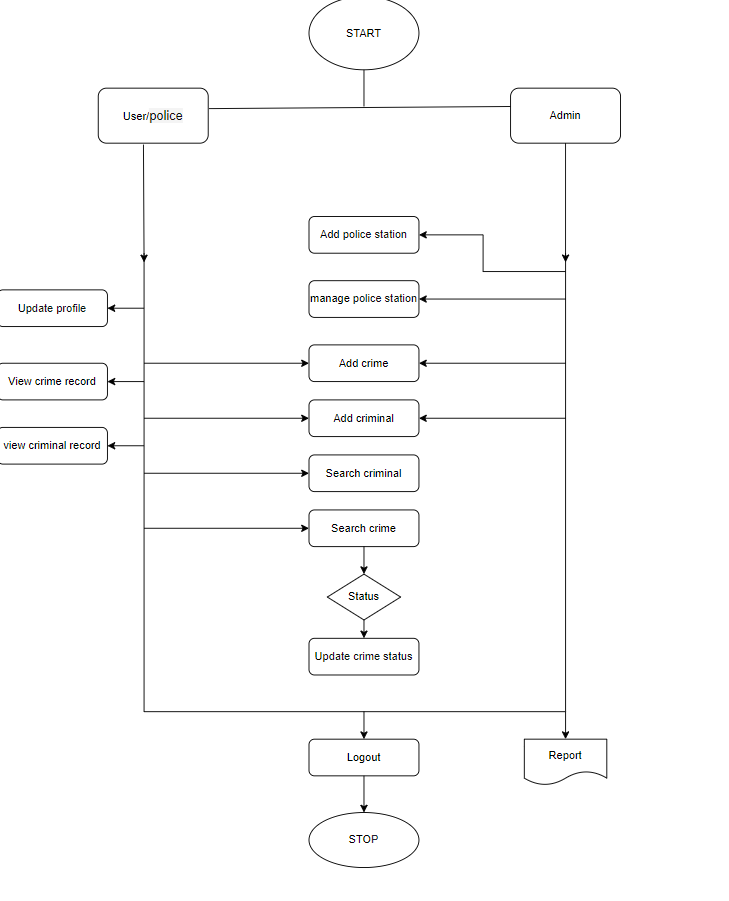

# Crime Information Management System

The main aim of this system is to maintain and manage the detail information of the crime happened in  an  area under a particular police station. This software will be used by the police officials in the Police station.

## Flowchart

## Entity Relationship Diagram

[Documentation](./Documentation/crime_management_system_ERD.png)

## Demo

Insert gif or link to demo

